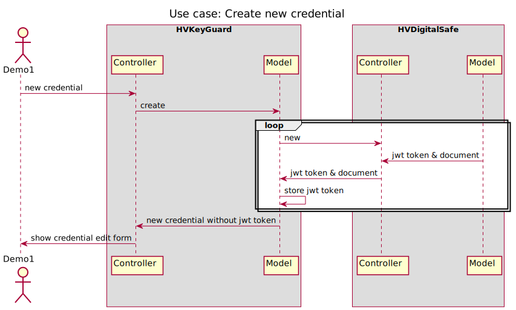

# HVKeyGuard 🔒

> **A secure, modular password manager app with JWT-based Rails-to-Rails communication.**

---

# ⚠️ Disclaimer

Please note that **I am not an IT security expert**.  
Use this application at your own risk and make sure you review the code and security setup yourself!

📄 See the [Disclaimer](https://hvkeyguard.demo.hvboom.biz/Disclaimer.html) for important usage information.

---


---

## 📖 About

**HVKeyGuard** is a lightweight password manager app.  
It securely communicates with [**HVDigitalSafe**](https://github.com/HVboom/HVDigitalSafe) to store encrypted credentials.

- Credentials are stored **outside** of HVKeyGuard.
- Communication is secured with **JWT authentication**.
- Designed as a **case study** for secure, modular Rails app interaction.

---

## 🚀 Installation & Setup

### Requirements

- Ruby 3.3.5
- Rails 7.2
- PostgreSQL 16.6
- Apache 2.4+ with [Phusion Passenger](https://github.com/HVboom/HowTo-DigitalOcean/wiki/Phusion-Passenger)

### Preparation

- [Apache setup guide](https://github.com/HVboom/HowTo-DigitalOcean/wiki/Apache)
- [Phusion Passenger setup guide](https://github.com/HVboom/HowTo-DigitalOcean/wiki/Phusion-Passenger)

⚡ **Important**:  
A real domain name is required due to Rails [host authorization](https://guides.rubyonrails.org/security.html#host-authorizations).

---

### 1. Clone the Repositories

```bash
git clone https://github.com/HVboom/HVKeyGuard.git
git clone https://github.com/HVboom/HVDigitalSafe.git
```

---

### 2. Create a `.bundle/config` for Production

In **both** apps (HVKeyGuard and HVDigitalSafe), create a `.bundle/config` file with:

```yaml
---
BUNDLE_WITHOUT: "development:test"
BUNDLE_FROZEN: true
BUNDLE_PATH: "vendor/bundle"
BUNDLE_DISABLE_SHARED_GEMS: true
```

---

### 3. Install Dependencies

```bash
bundle install
```

---

### 4. Setup Environment-Specific Credentials

Edit your production credentials:

```bash
EDITOR=vi rails credentials:edit --environment=production
```

> **ℹ️ Hint:**  
> An example file is available at [`config/credentials.yml.example`](config/credentials.yml.example) to guide your setup.

You must configure endpoints, JWT secrets, and communication settings.

---

### 5. Setup the Databases

Create and load the databases:

```bash
rails db:create db:schema:load
```

> **ℹ️ Hint:**  
> Setup examples and hints are found in [`db/seeds.rb`](db/seeds.rb).  
> It is safe to load seeds even in production (they do not create records by default).

---

### 6. Setup Initial Data (HVDigitalSafe)

In the **HVDigitalSafe** app folder:

Start the console in production mode:

```bash
bundle exec rails console -e production
```

Create your initial "safe boxes":

```ruby
SecureDataStorage.seed!
```

You can run `SecureDataStorage.seed!` multiple times to prepare more safe boxes if needed.

Generate your API key for HVKeyGuard communication:

```ruby
API_KEY_AUD = Rails.application.credentials[:api_key_aud]
audience = "<your-custom-audience>" # Or use SecureRandom.base58(32)
HVCrypto::JWT.encode(audience, { aud: API_KEY_AUD })
```

Use the generated JWT token in HVKeyGuard to configure communication securely.

---

### 7. Create Users and Access Groups (HVKeyGuard)

In the **HVKeyGuard** app folder:

```bash
rails console -e production

# Example: Create access group
access_group = AccessGroup.create!(name: "Admins")

# Example: Create user using the name to setup the default access group
user = User.create!(
  name: "Demo"
  email: "admin@example.com",
  password: "super-secure-password"
)

# The user's default access group is set automatically, but can be overridden:
user.default_access_group = AccessGroup.find_by(name: "Admins")

# To add additional group access:
user.access_groups << AccessGroup.find_by(name: "OtherGroup")
```

🔒 **Important:**  
HVKeyGuard does not provide a UI for user management — everything is managed manually for security reasons.

### ⚡ **Security Tip**

> After creating users and generating API keys, **remove your console history** to avoid leaking sensitive information:
>
>         rm $HOME/.irbrc_history

---

### 8. Configure Apache Virtual Hosts

Configure your vhosts similar to:

- [Example vhost configuration](https://github.com/HVboom/UbuntuApacheConfiguration/blob/main/sites-available/030_vhost_443_rails.conf)

Make sure the PassengerRoot and PassengerRuby settings are correct for your server.

---

### 9. Final Steps

After setup, clear caches and restart apps:

```bash
RAILS_ENV=production bundle exec rails tmp:clear log:clear restart
```

---

## 🔑 Architecture Overview

The following diagram shows the high-level interaction between HVKeyGuard and HVDigitalSafe:



---

## 🌐 Demo Access

You can try out HVKeyGuard online using the demo environment:

🔗 [https://hvkeyguard.demo.hvboom.biz](https://hvkeyguard.demo.hvboom.biz)

### Demo Credentials

| User  | Password |
| :---: | :------: |
| Demo1 |   Demo   |
| Demo2 |   Demo   |

All secured credentials in the demo environment are also protected with the password `Demo`.

## 🧪 Testing

Basic RSpec setup is included.  
Run tests with:

```bash
bundle exec rspec
```

---

## 📄 License

Distributed under the [MIT License](LICENSE).

---

# 🎯 You’re ready to protect your credentials with HVKeyGuard!
